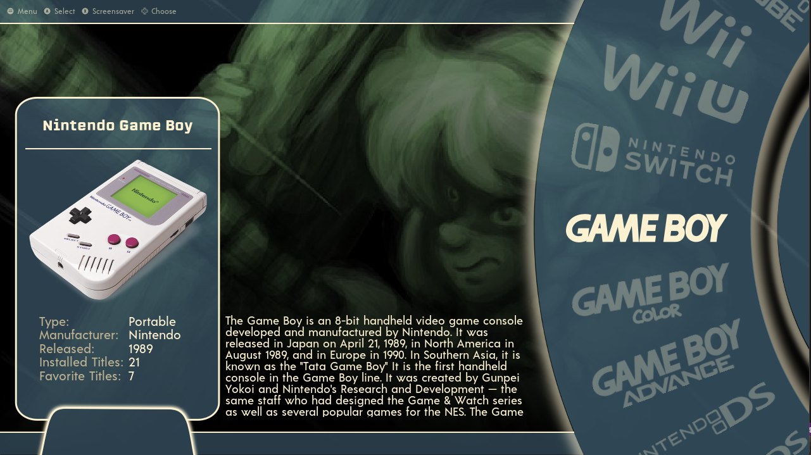
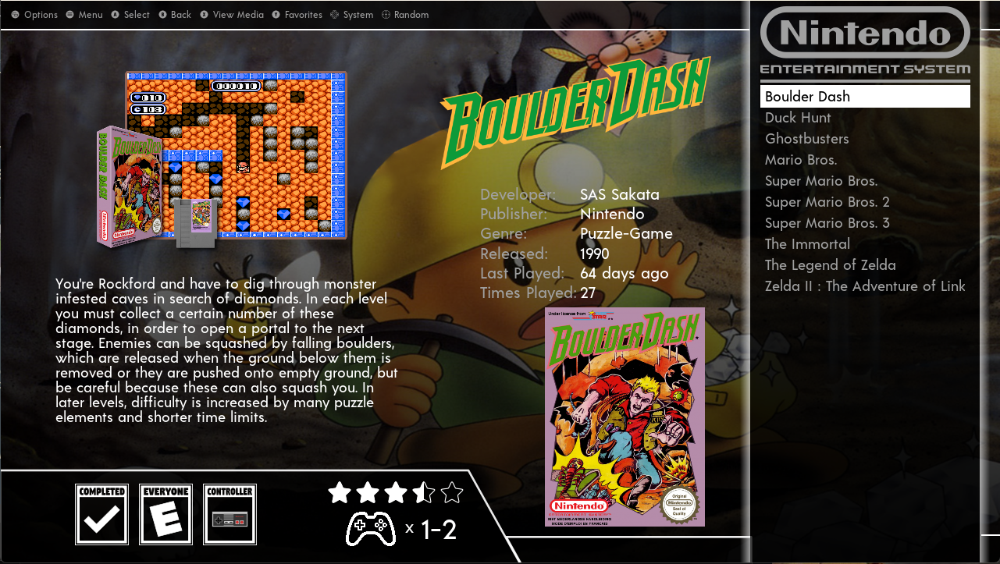

# CodyWheel Intertpreted for EmulationStation Desktop Edition v2.0

A simple alternate carousel theme set for ES-DE.

Customization options are available:

Add System Specific artwork - Place .jpg or .png inside systems/artwork to override default game art (image will be cropped to fit)
Add Information for Custom Systems/ themed collections - place {systemshortname}.xml inside systems/metadata-custom (Blank file included as base)

The following options are included:

3 variants:

- Gamelist grid
- Gamelist Carousel 
- Gamelist Text

12 color schemes:

- Black & White
- Gold
- Blue
- Gameboy
- Hitman
- Retro
- Stay Classy
- Black n Blue
- Chilled
- Purple Rain
- Rusty
- Sega

4 aspect ratios:

- 16:9
- 16:10
- 4:3
- 21:9

# Credits

The theme is has images from Dan Patricks Svg Logo and Vikings Hardware set on launchbox forums
Antfortytwo for the system meta pack and as always Leon for the F******G Gradient advice

